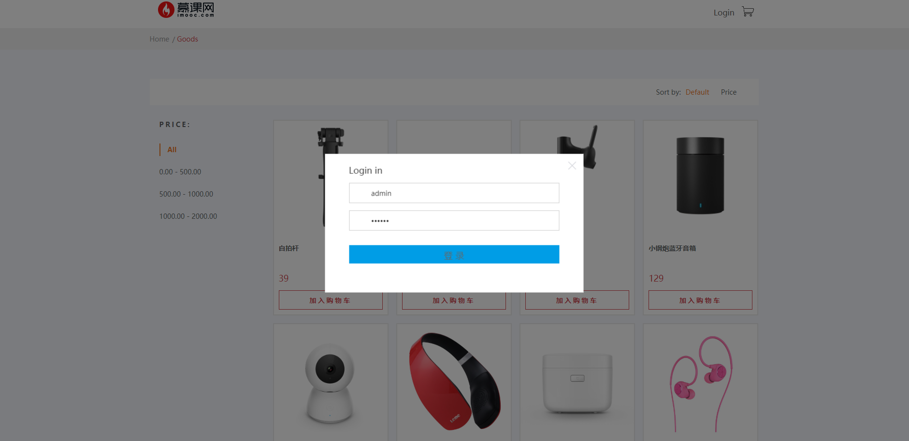
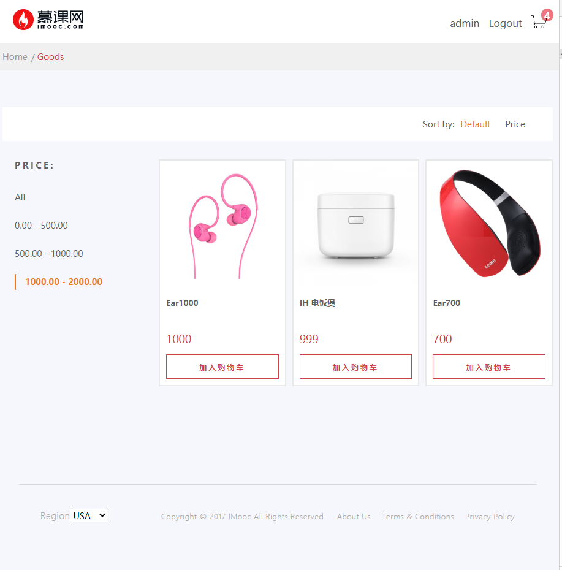
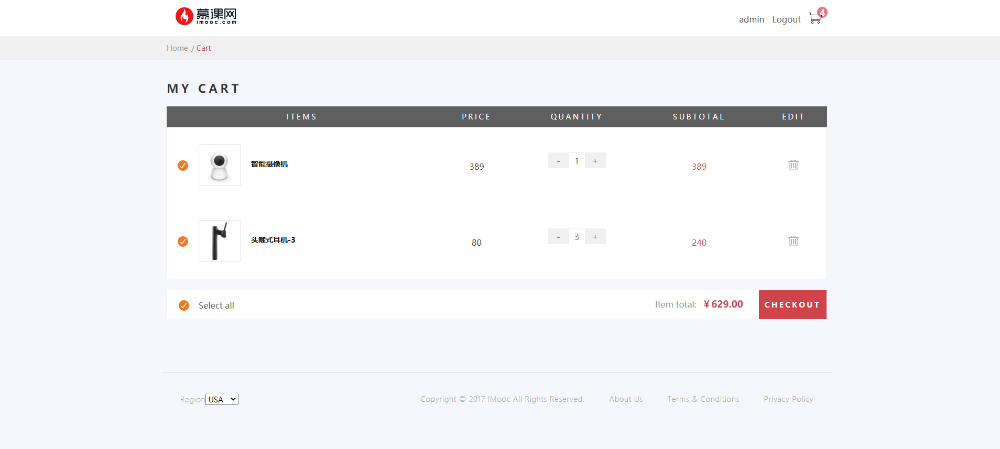
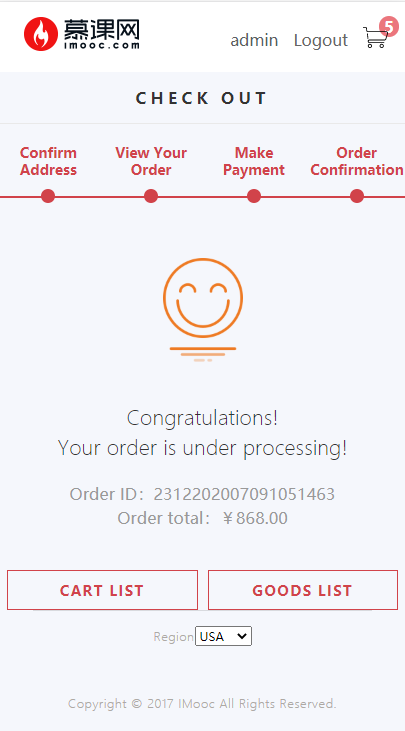

## 说明
包含前后端的低仿亚马逊购物平台。相对简易但完整的一套购物流程，简单的移动端适配(非重点)

> 如果对您对此项目有兴趣，可以点 "Star" 支持一下 谢谢！🙏

> 或者您可以 "follow" 一下，我会不断开源更多的有趣的项目 👻

> 如有问题请直接在 Issues 中提，或者您发现问题并有非常好的解决方案，欢迎 PR 💯

> 开发环境: window10专业版; nodejs v12.13.1; subl

> 更多探索：[低仿去哪儿移动app](https://github.com/lumengxin/Travel.git)    [电商后台管理系统](https://github.com/lumengxin/vue-shop.git)


### 技术栈

前端：vue + vuex + vue-router + vue-lazyload + vue-infinite-scroll + axios + less
后端：express + cookie-parser + ejs + http-errors + mongoose + morgan

### 项目运行
#### 分支说明：
- master: 前后端合在一起，开发时使用方便
- dev: 分离后端

**master:**
```
git clone https://github.com/lumengxin/vue-pc-shop.git
npm install
npm start                   // 开启node服务
npm run serve               // 运行
npm run build               // 打包上线
```

### 更多阅读

- [笔记](./docs/note.md)
- [静态界面](./docs/resource)

## 项目预览：

[在线演示](http://www.byooka.com/v19/vue-pc-shop)

**效果展示：**

<div style="display:flex;flex-wrap:wrap;">
    
    
    
    
    
</div>


